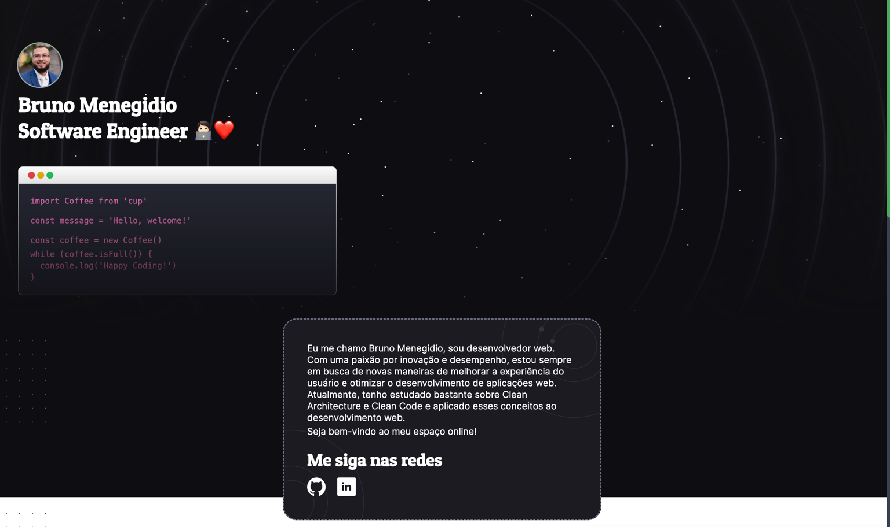

<h1>
  <a href="https://bmenegidio.github.io/bmenegidio.me/">
    bmenegidio.me
  </a>
</h1>

  
  

Meu site pessoal desenvolvido com [Next.js](https://nextjs.org/), hospedado no [Github Pages](https://pages.github.com/) utilizando Github Actions. Você pode acessar o site [clicando aqui](https://bmenegidio.github.io/bmenegidio.me/).

## **Tecnologias Utilizadas**

- ⚛ **React** — Biblioteca para construção de interfaces de usuário
- ⚡ **Next.js** — Gerador de site estático usando static exports
- 💅 **CSS** — Tailwind CSS para estilização
- 💖 **Lint** — ESlint, Prettier e EditorConfig para linting e formatação

## Executando o Projeto

1. `npm i`;
2. `npm run dev`;
